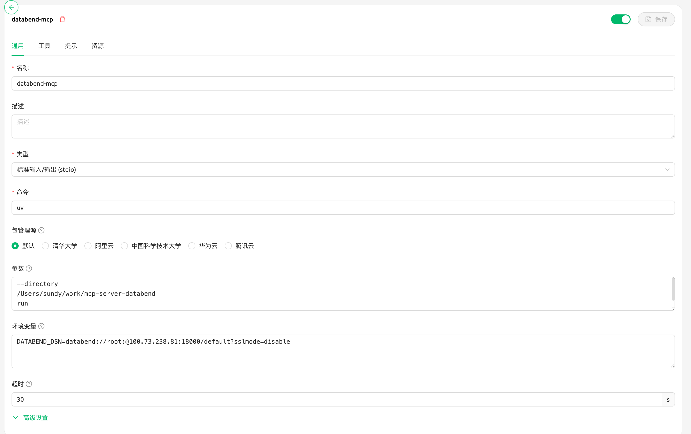
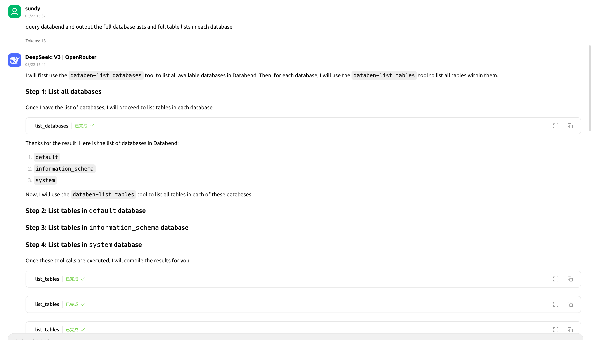

# mcp-server-databend
MCP server of databend

# Install

```bash
uv sync --all-groups --all-extras
```

# ENV configs

| ENV | usage | default value |
| --- | --- | --- |
| DATABEND_DSN | The dsn connect string | databend://default:@127.0.0.1:8000/?sslmode=disable|


# Example for using `cherry studio`





# Dev testing

```bash
mcp dev server.py
```
